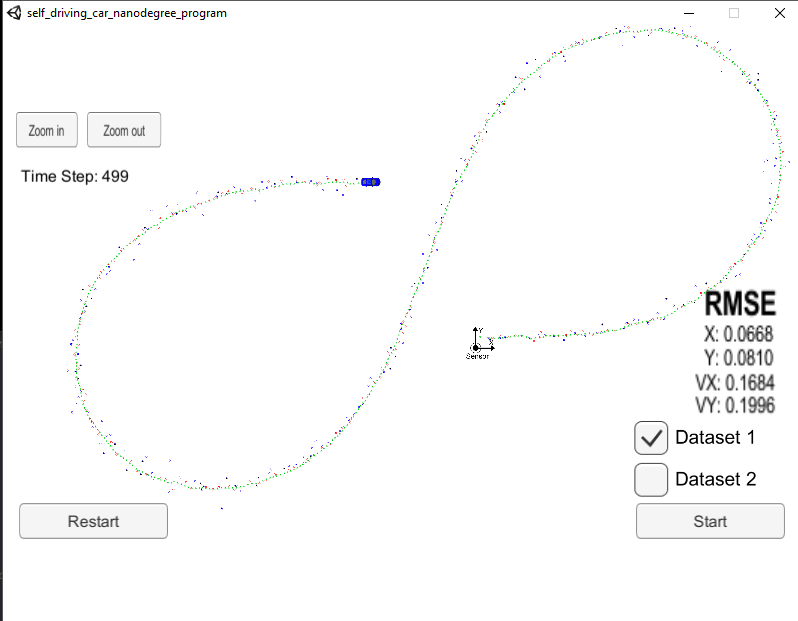
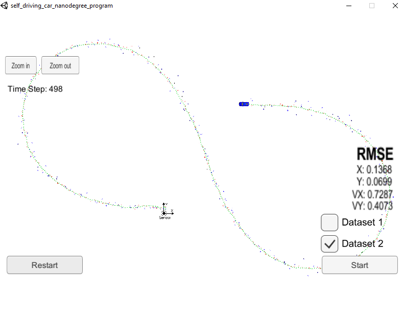

# Unscented Kalman Filter
[](http://www.udacity.com/drive)

Tips for setting up your environment can be found [here](https://classroom.udacity.com/nanodegrees/nd013/parts/40f38239-66b6-46ec-ae68-03afd8a601c8/modules/0949fca6-b379-42af-a919-ee50aa304e6a/lessons/f758c44c-5e40-4e01-93b5-1a82aa4e044f/concepts/23d376c7-0195-4276-bdf0-e02f1f3c665d)

The program main.cpp has already been filled out.  
Here is the main protcol that main.cpp uses for uWebSocketIO in communicating with the simulator.

**INPUT**: values provided by the simulator to the c++ program
* `sensor_measurement` => the measurment that the simulator observed (either lidar or radar)


**OUTPUT**: values provided by the c++ program to the simulator
* `estimate_x` <= kalman filter estimated position x
* `estimate_y` <= kalman filter estimated position y
* `rmse_x`
* `rmse_y`
* `rmse_vx`
* `rmse_vy`

---

## Other Important Dependencies
* cmake >= 3.5
  * All OSes: [click here for installation instructions](https://cmake.org/install/)
* make >= 4.1 (Linux, Mac), 3.81 (Windows)
  * Linux: make is installed by default on most Linux distros
  * Mac: [install Xcode command line tools to get make](https://developer.apple.com/xcode/features/)
  * Windows: [Click here for installation instructions](http://gnuwin32.sourceforge.net/packages/make.htm)
* gcc/g++ >= 5.4
  * Linux: gcc / g++ is installed by default on most Linux distros
  * Mac: same deal as make - [install Xcode command line tools](https://developer.apple.com/xcode/features/)
  * Windows: recommend using [MinGW](http://www.mingw.org/)

## Basic Build Instructions

1. Clone this repo.
2. Make a build directory: `mkdir build && cd build`
3. Compile: `cmake .. && make`
4. Run it: `./UnscentedKF`

## Description
The goal was to create a Unscented Kalman Filter to make preditions using the CTRV motion model and then to fuse the data from the Laser and Radar measurements to make updates to the postion.

## Initialization paramaters
As in any Kalman filter, we must initialize the state vector and the state covariance. For it is necessary to distinguish which sensor the first measurement belongs (Radar or Laser).
* Radar
  * `x_`: I set the *v* to 4 m / s.
  * `P_`: The diagonal of the matrix are the variances for each value within the `x_` state space (px, py, v, yaw, yawd). We are given the *standard deviation* of each of these, and the square of the standard deviation is the *variance*.

* Lidar
  * `x_`: I set the *v* to 4 m / s. I chose yaw of .5 with yawd as 0 given no expected big swerves at the start.
  * `P_`: The diagonal of the matrix are the variances for each value within the `x_` state space (px, py, v, yaw, yawd). We are given the *standard deviation* of px and py, and the square of the standard deviation is the *variance*. I just used 1 for the other variances along the diagonal as a reasonable beginning value.

  ```
  if (meas_package.sensor_type_ == MeasurementPackage::RADAR) {
    cout << "EKF : First measurement RADAR" << endl;
    // Convert radar from polar to cartesian coordinates and initialize state.
    double rho = meas_package.raw_measurements_[0]; // range
    double phi = meas_package.raw_measurements_[1]; // bearing
    double rho_dot = meas_package.raw_measurements_[2]; // velocity of rho

    // Coordinates convertion from polar to cartesian
    x_ << rho * cos(phi), rho * sin(phi), 4, rho_dot * cos(phi), rho_dot * sin(phi);

    //state covariance matrix
    P_ << std_radr_*std_radr_, 0, 0,           0, 0,
          0, std_radr_*std_radr_, 0,           0, 0,
          0,                   0, 1,           0, 0,
          0,                   0, 0, std_radphi_, 0,
          0,                   0, 0, 0, std_radphi_;

  }
  else if (meas_package.sensor_type_ == MeasurementPackage::LASER) {
    // No velocity and coordinates are cartesian already.
    cout << "EKF : First measurement LASER" << endl;
    x_ << meas_package.raw_measurements_(0), meas_package.raw_measurements_(1), 4, 0.5, 0.0;

    //state covariance matrix
    //***** values can be tuned *****
    P_ << std_laspx_*std_laspx_, 0, 0, 0, 0,
          0, std_laspy_*std_laspy_, 0, 0, 0,
          0,                     0, 1, 0, 0,
          0,                     0, 0, 1, 0,
          0,                     0, 0, 0, 1;
  }
  ```

It was also necessary to tune some parameters, for which we have made a series of tests, whose results are shown below.

| std_a_    | std_yawdd_ | rmse_x | rmse_y | rmse_vx | rmse_vy |
| :-------- | :--------- | ------ | ------ | ------- | ------- |
| 0.5       | 0.5        | 0.0619 | 0.0842 | 0.1639  | 0.1954  |
| 0.5       | 1          | 0.0603 | 0.0859 | 0.1719  | 0.2059  |
| 1         | 0.5        | 0.0668 | 0.0810 | 0.1684  | 0.1996  |
| 1         | 1          | 0.0654 | 0.0825 | 0.1734  | 0.2069  |
| 1         | 1.5        | 0.0653 | 0.0837 | 0.1861  | 0.2223  |
| 1.5       | 1          | 0.0686 | 0.0823 | 0.1811  | 0.2136  |

```
// Process noise standard deviation longitudinal acceleration in m/s^2
std_a_ = 1;

// Process noise standard deviation yaw acceleration in rad/s^2
std_yawdd_ = 0.5;
```

### Comparisons

| Input | EKF-Fused | UKF-Fused |
| ----- | --------- | --------- |
|  px   |  0.0973   |  0.0668   |
|  py   |  0.0855   |  0.0810   |
|  vx   |  0.4523   |  0.1684   |
|  vy   |  0.4399   |  0.1996   |

### Results




